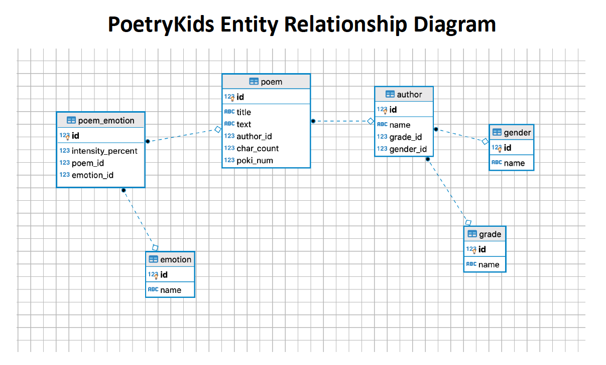

# SQL Assessment - Poetry by Kids

> **Note:** The data in this exercise is derived from the datasets found [here](https://github.com/whipson/PoKi-Poems-by-Kids). An academic paper describing the PoKi project can be found [here](https://arxiv.org/abs/2004.06188)
> The data is used for education purposes with permission from the maintainer.  

The data have been normalized to third normal form (3NF). Take care in choosing the correct primary and foreign key pairs to join on.

### Setup 
1. Create a database named `PoetryKids` on your PostreSQL Server.
2. Right-click on the empty database and choose the `Restore` option. Navigate to the `poetrykids.tar` file by clicking on the ellipsis (`...`). Leave the defaults for all other options.

### ERD

### Assessment
**Write SQL Queries to answer the questions below. Save your queries to a `.sql` script along with the answers (as comments) to the questions posed.**

1. The poetry in this database is the work of children in grades 1 through 5.  
    a. How many poets from each grade are represented in the data?  
    b. How many of the poets in each grade are Male and how many are Female? Only return the poets identified as Male or Female.  
    c. Do you notice any trends across all grades?

2. Love and death have been popular themes in poetry throughout time. Which of these things do children write about more often? Which do they have the most to say about when they do? Return the **total number** of poems that mention **love** and **total number** that mention the word **death**, and return the **average character count** for poems that mention **love** and also for poems that mention the word **death**. Do this in a single query.

3. Do longer poems have more emotional intensity compared to shorter poems?  
a. Start by writing a query to return each emotion in the database with its average intensity and average character count.   
     - Which emotion is associated the longest poems on average?  
     - Which emotion has the shortest?  

    b. Convert the query you wrote in part a into a CTE. Then find the 5 most intense poems that express joy and whether they are to be longer or shorter than the average joy poem.   
     -  What is the most joyful poem about?  
     -  Do you think these are all classified correctly?

4. Compare the 5 most angry poems by 1st graders to the 5 most angry poems by 5th graders.  

	a. Which group writes the angreist poems according to the intensity score?  
    b. Who shows up more in the top five for grades 1 and 5, males or females?  
    c. Which of these do you like the best?

5. Emily Dickinson was a famous American poet, who wrote many poems in the 1800s, including one about a caterpillar that begins:

	  	> A fuzzy fellow, without feet,
		> Yet doth exceeding run!
		> Of velvet, is his Countenance,
		> And his Complexion, dun!

	a. Examine the poets in the database with the name `emily`. Create a report showing the count of emilys by grade along with the distribution of emotions that characterize their work.  
	b. Export this report to Excel and create a visualization that shows what you have found.
